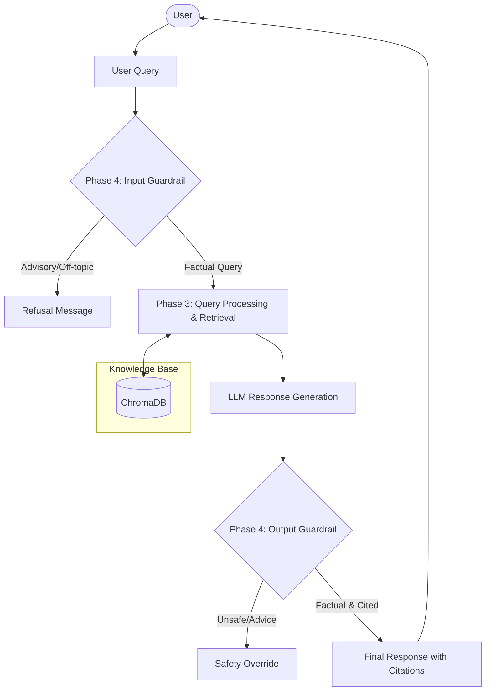

# Phase-Wise Architecture: Mutual Fund FAQ Assistant

This document outlines the phase-wise architecture and implementation plan for the Mutual Fund FAQ Assistant, based on the provided problem statement. The architecture leverages a Retrieval-Augmented Generation (RAG) approach to ensure facts-only, source-backed responses.

---

## System Architecture Overview

### High-Level RAG Flow


---

## Phase 1: Corpus Definition and Data Collection
**Objective:** Curate the public knowledge base that will serve as the single source of truth for the assistant.

*   **1.1 Scheme Selection:** 
    *   Target Asset Management Company (AMC): HDFC Mutual Fund.
    *   Selected 5 diverse mutual fund schemes.
*   **1.2 Document Sourcing (Limited to 5 URLs):**
    *   The corpus is strictly limited to the following 5 URLs:
        1. [HDFC Mid-Cap Opportunities Fund](https://groww.in/mutual-funds/hdfc-mid-cap-fund-direct-growth)
        2. [HDFC Flexi Cap Fund](https://groww.in/mutual-funds/hdfc-equity-fund-direct-growth)
        3. [HDFC Focused 30 Fund](https://groww.in/mutual-funds/hdfc-focused-fund-direct-growth)
        4. [HDFC ELSS Tax Saver Fund](https://groww.in/mutual-funds/hdfc-elss-tax-saver-fund-direct-plan-growth)
        5. [HDFC Top 100 Fund (Large Cap)](https://groww.in/mutual-funds/hdfc-large-cap-fund-direct-growth)
*   **1.3 Data Curation:**
    *   Ensure data extraction is focused strictly on factual information available on these specific URLs (e.g., expense ratio, exit load, minimum SIP, lock-in period, riskometer, benchmark).

## Phase 2: Data Ingestion and Knowledge Base Construction
**Objective:** Process the collected documents and build a searchable vector database.

*   **2.1 Data Extraction:** Extract raw text and tables from the collected PDFs and web pages.
*   **2.2 Chunking:** Split the extracted text into smaller, semantically meaningful chunks (e.g., by document sections or paragraphs) to optimize retrieval.
*   **2.3 Metadata Tagging:** Attach essential metadata to each chunk, crucially including the **Source URL** and the **Last Updated Date**.
*   **2.4 Embedding Generation:** Convert the text chunks into dense vector embeddings using an embedding model.
*   **2.5 Vector Database Integration:** Store the embeddings and associated metadata in a Vector Database (e.g., ChromaDB, Pinecone, or FAISS) for efficient similarity search.
*   **2.6 Data Refresh Scheduler:** Implement a **GitHub Actions** workflow to automatically re-run Phase 1 and Phase 2 on a daily cron schedule, ensuring the Vector DB stays updated with the latest scheme facts without requiring a local background server.

    #### Data Refresh Pipeline Flow
    ```mermaid
    graph LR
        Trigger[GitHub Actions Schedule / Manual] --> Scraper[Phase 1: Web Scraper]
        Scraper --> RawData[(Raw JSON Data)]
        RawData --> Extractor[Phase 2.1: Data Extractor]
        Extractor --> ProcessedData[(Processed JSON Facts)]
        ProcessedData --> Chunker[Phase 2.2: Semantic Chunker]
        Chunker --> Embedder[Phase 2.4: Embedding Model]
        Embedder --> VDB[(ChromaDB)]
        VDB --> Commit[GitHub Auto-Commit Data Changes]
    ```

## Phase 3: Core RAG Engine Implementation
**Objective:** Develop the core retrieval and response generation pipeline.

*   **3.1 Query Processing:** Accept the user's natural language query and convert it into a vector embedding using the same model from Phase 2.
*   **3.2 Semantic Retrieval:** Query the Vector Database to retrieve the top-K most relevant document chunks based on the query's embedding.
*   **3.3 Prompt Engineering (Contextualization):** Construct a strict system prompt that instructs the Large Language Model (LLM) to:
    *   Answer *only* using the retrieved context.
    *   Keep the response concise (maximum 3 sentences).
    *   Maintain a neutral, factual tone.
*   **3.4 Generation & Formatting:** Generate the response and automatically append the required footer: `"Last updated from sources: <date>"` and the specific citation link retrieved from the metadata.

## Phase 4: Guardrails and Compliance Layer
**Objective:** Implement strict controls to ensure the assistant provides *only* factual information and refuses advisory queries.

*   **4.1 Intent Classification (Pre-Retrieval):** 
    *   Analyze the incoming query to determine if it is asking for investment advice, performance comparisons, or predictions (e.g., "Should I invest?", "Which is better?").
*   **4.2 Refusal Handling System:**
    *   If a query is classified as advisory/non-factual, bypass the RAG pipeline.
    *   Return a predefined, polite refusal template reinforcing the "facts-only" limitation.
    *   Provide an educational link (e.g., to AMFI or SEBI) as part of the refusal.
*   **4.3 Output Validation (Post-Generation):**
    *   Ensure the generated output strictly adheres to the 3-sentence limit.
    *   Verify that exactly one citation link is present.
    *   Ensure no PII (PAN, Aadhaar, account numbers) was accidentally processed or echoed back.

## Phase 5: Custom User Interface & API Development
**Objective:** Build a high-fidelity, decoupled web application matching the "FundQuest AI" design.

*   **5.1 Backend API (FastAPI):**
    - Develop a REST API to expose the RAG engine.
    - Implement a structured response format that returns both qualitative summaries and quantitative metrics (e.g., Expense Ratio, Exit Load).
    - Configure CORS for secure communication with the frontend.
*   **5.2 Frontend Development (React + Tailwind):**
    - Build a modern Dark Mode Dashboard using **Vite**, **React**, and **Tailwind CSS** (Midnight Forest & Mint Teal palette).
    - **Dashboard Sidebar:** Implement navigation for "Knowledge Base", "Example Queries", "Recent Sessions", "Compliance Logs", and "Documentation".
    - **Branded Header:** Feature "FundQuest AI" branding with "Market Data", "Portfolio", and "Disclosures" navigation links.
    - **Safety Indicators:** Display a high-visibility "FACTS-ONLY MODE ACTIVE" amber badge in the navbar to reinforce compliance.
    - **Analysis Core Cards:** Implement modular response containers that display factual summaries alongside highlighted metric boxes (e.g., Expense Ratio, NAV).
    - **Source Attribution:** Each card includes a footer with a clickable "Source" link and a "Last Updated" timestamp.

## Phase 6: Deployment & Infrastructure
**Objective:** Deploy the decoupled architecture to scalable cloud platforms.

*   **6.1 Backend Deployment (Railway):**
    - Deploy the FastAPI server to **Railway.app**.
    - Configure persistent storage for ChromaDB.
    - Set up environment variables for `GROQ_API_KEY`.
*   **6.2 Frontend Deployment (Vercel):**
    - Deploy the React application to **Vercel**.
    - Configure API environment variables to point to the Railway backend.
*   **6.3 CI/CD & Data Refresh:**
    - Maintain the GitHub Actions daily data refresh pipeline.
    - Ensure the updated Vector DB is accessible to the deployed backend.

## Phase 7: Testing, Evaluation, and Documentation
**Objective:** Validate system performance against success criteria and finalize deliverables.

*   **6.1 Quality Assurance (QA):**
    *   Test factual queries to ensure accurate retrieval and correct formatting (max 3 sentences, 1 link, footer).
*   **6.2 Adversarial Testing:**
    *   Input advisory and performance-comparison queries to rigorously test the Refusal Handling System.
*   **6.3 Documentation:**
    *   Create a comprehensive `README.md` containing setup instructions, the list of selected AMC/schemes, the architecture overview, and known limitations.
*   **6.4 Final Review:** Verify all constraints (no PII storage, no third-party sources) are met before finalizing the project.
